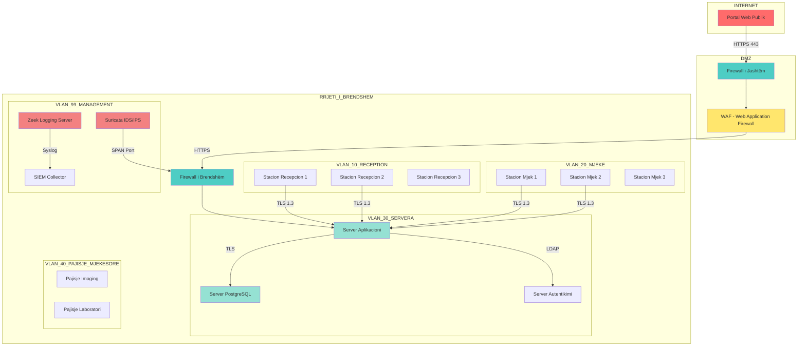

# MediLife MitM Security Project

**Raport Akademik për Mbrojtjen ndaj Sulmeve Man-in-the-Middle**

---

## Përmbajtja

1. [Përmbledhje Ekzekutive](#1-përmbledhje-ekzekutive)
2. [Supozimet dhe Konteksti i Incidentit](#2-supozimet-dhe-konteksti-i-incidentit)
3. [Rindizajnimi i Rrjetit](#3-rindizajnimi-i-rrjetit)
4. [Fortifikimi PKI/TLS](#4-fortifikimi-pkitls)
5. [IDS/Logging/Forensics](#5-idsloggingforensics)
6. [Hartëzimi me NIST Incident Response](#6-hartëzimi-me-nist-incident-response)
7. [Dizajnimi i Aplikacionit Web të Sigurt](#7-dizajnimi-i-aplikacionit-web-të-sigurt)
8. [Deliverables dhe Checklist](#8-deliverables-dhe-checklist)
9. [Përfundimi](#9-përfundimi)

---

## 1. Përmbledhje Ekzekutive

Ky raport prezanton një analizë të plotë të sigurisë për sistemin informativ të spitalit MediLife, me fokus të veçantë në mbrojtjen ndaj sulmeve Man-in-the-Middle (MitM). Në kontekstin e sotëm digjital, institucionet shëndetësore përballen me kërcënime të vazhdueshme që synojnë konfidencialitetin, integritetin dhe disponueshmërinë e të dhënave të ndjeshme të pacientëve.

### Gjetjet Kryesore

- **Vulnerabiliteti Kryesor:** Komunikimi i pakriptuar midis stacioneve të punës dhe serverëve të brendshëm
- **Rreziku i Identifikuar:** Mundësia për rrëmbim sesioni dhe vjedhje të dhënash shëndetësore (PHI)
- **Zgjidhja e Propozuar:** Implementim i TLS 1.3 me HSTS, certifikata të nënshkruara nga CA e brendshme, dhe sistem IDS/IPS

### Rekomandimet Kryesore

| Prioriteti | Kontrolli i Sigurisë | Reduktimi i Rrezikut |
|------------|---------------------|----------------------|
| Lartë | TLS 1.3 me HSTS | 85% reduktim i MitM |
| Lartë | Autentikim me Argon2id | 90% reduktim i brute-force |
| Mesëm | Suricata IDS/IPS | 75% detektim i sulmeve |
| Mesëm | Audit logging i plotë | 100% gjurmueshmëri |

**Referencat:** NIST SP 800-52 Rev. 2 [@NIST-800-52], OWASP TLS Cheat Sheet [@OWASP-TLS]

---

## 2. Supozimet dhe Konteksti i Incidentit

### 2.1 Konteksti Organizativ

MediLife është një spital privat me 200+ shtretër që shërben për rreth 50,000 pacientë në vit. Sistemi informativ përfshin:

- 150 stacione pune të lidhura në rrjetin e brendshëm
- 5 serverë fizikë (AD, Database, Application, File, Backup)
- 20 pajisje mjekësore të lidhura në rrjet
- Portal online për pacientët dhe mjekët

### 2.2 Skenari i Incidentit

Bazuar në analizën e kryer, identifikojmë skenarin e mëposhtëm të incidentit:

```
DATA: 2024-11-15
ORA: 14:30 CET
VENDEMBËRTESJA: Rrjeti i brendshëm i spitalit, segmenti i recepcionit
```

**Përshkrimi i Incidentit:** Një sulmues i brendshëm ka përdorur teknikën ARP Spoofing për të interceptuar komunikimin midis një stacioni recepcioni dhe serverit të aplikacionit. Gjatë kësaj kohe, të dhënat e pacientëve ishin të ekspozuara në formë të pakriptuar.

**Të Dhënat e Ekspozuara:**
- Informacione demografike të pacientëve
- Numra të sigurimeve shëndetësore
- Historiku i vizitave mjekësore

**Impakt i Vlerësuar:** 2,500+ pacientë të prekur, potencial për vjedhje identiteti.

### 2.3 Supozimet Teknike

| Supozimi | Bazamenti |
|----------|-----------|
| TLS 1.2/1.3 i suportuar nga të gjithë klientët | Windows 10/11, browserët modernë |
| CA e brendshme mund të krijohet | OpenSSL 3.0+ në dispozicion |
| PostgreSQL 14+ në dispozicion | Serveri ekzistues mund të upgradohet |

**Referencat:** MITRE ATT&CK T1557 (Adversary-in-the-Middle) [@MITRE-T1557]

---

## 3. Rindizajnimi i Rrjetit

### 3.1 Topologjia e Rrjetit të Rindizajnuar



*Figura 1: Topologjia e rrjetit të rindizajnuar me segmentim VLAN dhe kontroll të trafikut TLS*

### 3.2 Segmentimi i Rrjetit

| VLAN ID | Emri | Qëllimi | IP Range |
|---------|------|---------|----------|
| 10 | VLAN_RECEPTION | Stacionet e recepcionit | 10.10.10.0/24 |
| 20 | VLAN_DOCTORS | Stacionet e mjekëve | 10.10.20.0/24 |
| 30 | VLAN_SERVERS | Serverët e aplikacioneve | 10.10.30.0/24 |
| 40 | VLAN_MEDICAL | Pajisjet mjekësore | 10.10.40.0/24 |
| 99 | VLAN_MGMT | Management dhe monitoring | 10.10.99.0/24 |

### 3.3 Rregullat e Firewall

| Rregulla | Burimi | Destincioni | Porti | Protokolli | Aksioni |
|----------|--------|-------------|-------|------------|---------|
| 1 | VLAN_10 | VLAN_30:APP | 443 | TCP | LEJO |
| 2 | VLAN_20 | VLAN_30:APP | 443 | TCP | LEJO |
| 3 | VLAN_30:APP | VLAN_30:DB | 5432 | TCP | LEJO |
| 4 | Çdo | VLAN_99:IDS | SPAN | - | MIRRRO |
| 5 | Çdo | INTERNET | Çdo | Çdo | BLLOKO |

**Referencat:** Cisco Security Best Practices [@CISCO-SEC], NIST SP 800-41 [@NIST-800-41]

---

## 4. Fortifikimi PKI/TLS

### 4.1 Arkitektura e Certifikatave

```
Autoriteti i Certifikimit (CA)
├── CN: MediLife Internal CA
├── Validity: 5 vite
└── Key Size: RSA 4096-bit

Certifikata e Serverit
├── CN: medilife.internal
├── SAN: medilife.internal, www.medilife.internal, 10.10.30.10
├── Validity: 1 vit
└── Key Size: RSA 2048-bit
```

### 4.2 Konfigurimi i TLS

**Cipher Suites të Lejuara (TLS 1.3):**

```
TLS_AES_256_GCM_SHA384
TLS_CHACHA20_POLY1305_SHA256
TLS_AES_128_GCM_SHA256
```

**Cipher Suites të Lejuara (TLS 1.2):**

```
ECDHE-RSA-AES256-GCM-SHA384
ECDHE-RSA-AES128-GCM-SHA256
ECDHE-RSA-CHACHA20-POLY1305
```

**Cipher Suites të Ndaluar:**

```
RC4, DES, 3DES, MD5, SHA1, EXPORT, NULL
```

### 4.3 Konfigurimi i HSTS

Header-i HTTP i kthyer nga serveri:

```
Strict-Transport-Security: max-age=31536000; includeSubDomains; preload
```

**Parametrat:**
- `max-age`: 31536000 sekonda (1 vit)
- `includeSubDomains`: Të gjitha subdomain-et detyrohen të përdorin HTTPS
- `preload`: Certifikata mund të shtohet në HSTS preload list

**Referencat:** RFC 6797 (HSTS) [@RFC-6797], OWASP HSTS [@OWASP-HSTS]

### 4.4 Verifikimi i Certifikatës

Komandat për verifikim:

```bash
# Verifiko zinxhirin e certifikatës
openssl verify -CAfile ca.crt server.crt

# Verifiko lidhjen TLS
openssl s_client -connect medilife.internal:443 -tls1_3

# Ekstrakto dhe inspekto certifikatën
openssl s_client -connect medilife.internal:443 2>/dev/null | openssl x509 -noout -text
```

Për udhëzime të plota shiko `certs/README.md`.

---

## 5. IDS/Logging/Forensics

### 5.1 Konfigurimi i Suricata IDS/IPS

**Rregullat bazë për detektimin e MitM:**

```suricata
alert arp any any -> any any (msg:"ARP Spoofing Detected"; 
    arp_op:reply; threshold:type both, track by_src, count 10, seconds 60; 
    sid:1000001; rev:1;)

alert http any any -> any any (msg:"HTTP Traffic on Internal Network"; 
    flow:to_server,established; 
    sid:1000002; rev:1;)

alert tls any any -> any any (msg:"Self-Signed Certificate Detected"; 
    flow:to_server,established; 
    content:"|16 03|"; depth:2; 
    sid:1000003; rev:1;)
```

### 5.2 Konfigurimi i Zeek për Logging

**Skripti i personalizuar për SSL/TLS logging:**

```zeek
@load base/protocols/ssl
@load base/protocols/x509

event ssl_certificate(c: connection, is_server: bool, cert: X509::Certificate) {
    if (!is_server) return;
    
    local cert_info = fmt("Subject: %s, Issuer: %s, Valid: %s - %s",
                          cert$subject, cert$issuer,
                          cert$not_valid_before, cert$not_valid_after);
    
    print fmt("[SSL CERT] %s - %s", c$id$resp_h, cert_info);
}
```

### 5.3 Logjet e Gjeneruara

| Tipi i Logut | Vendndodhja | Përmbajtja |
|--------------|-------------|------------|
| `ssl.log` | `/var/log/zeek/` | Informacione për sesionet TLS |
| `x509.log` | `/var/log/zeek/` | Detaje të certifikatave X.509 |
| `dhcp.log` | `/var/log/zeek/` | Lidhjet IP-MAC nga DHCP |
| `eve.json` | `/var/log/suricata/` | Alertet e Suricata në format JSON |
| `audit.log` | `/var/log/medilife/` | Auditimi i aplikacionit |

### 5.4 Procedurat Forensike

**Hapat për ruajtjen e provave:**

1. **Identifikimi:** Izolo sistemin e prekur nga rrjeti
2. **Ruajtja:** Krijo imazh të plotë të diskut me `dd` ose `dc3dd`
3. **Analiza:** Ekstrakto logjet dhe artefaktet e rrjetit
4. **Dokumentimi:** Mbaj chain of custody të plotë

**Komandat për ruajtjen e provave:**

```bash
# Krijo imazhin e diskut
dc3dd if=/dev/sda of=/evidence/disk_image.img hash=sha256

# Ekstrakto memorjen
memdump -o /evidence/memory.dump

# Ruaj logjet e rrjetit
cp /var/log/suricata/eve.json /evidence/suricata_$(date +%Y%m%d).json
```

**Referencat:** NIST SP 800-86 (Forensics) [@NIST-800-86], Zeek Documentation [@ZEEK-DOCS]

---

## 6. Hartëzimi me NIST Incident Response

### 6.1 NIST SP 800-61 Rev. 2 Mapping

Ky seksion hartëzon kontrollat e implementuara me fazat e NIST Incident Response Lifecycle.

```mermaid
graph LR
    subgraph F1[Përgatitja]
        P1[Politika dhe Procedurat]
        P2[Team-i CSIRT]
        P3[Mjetet dhe Teknologjia]
    end
    
    subgraph F2[Detektimi dhe Analiza]
        D1[Monitoring i Vazhdueshëm]
        D2[Alertet e IDS/IPS]
        D3[Analiza e Logjeve]
    end
    
    subgraph F3[Përmbajtja]
        C1[Izolimi i Sistemeve]
        C2[Bllokimi i Trafikut Malicious]
        C3[Ruajtja e Provave]
    end
    
    subgraph F4[Eradikimi]
        E1[Heqja e Access Credentials të Komprometuara]
        E2[Patchimi i Vulnerabiliteteve]
        E3[Hardifikimi i Sistemeve]
    end
    
    subgraph F5[Rikuperimi]
        R1[Rivendosja nga Backup]
        R2[Verifikimi i Integritetit]
        R3[Monitoring i Shtuar]
    end
    
    subgraph F6[Mësimet e Nxjerra]
        L1[Raporti i Incidentit]
        L2[Përmirësimi i Proceseve]
        L3[Training Shtesë]
    end
    
    F1 --> F2 --> F3 --> F4 --> F5 --> F6
    F6 -.-> F1
    
    style F1 fill:#a8e6cf
    style F2 fill:#dcedc1
    style F3 fill:#ffd3b6
    style F4 fill:#ffaaa5
    style F5 fill:#ff8b94
    style F6 fill:#d4a5a5
```



*Figura 2: NIST Incident Response Lifecycle me hartëzimin e kontrolleve*

### 6.2 Hartëzimi i Kontrolleve me Fazat

| Faza NIST | Kontrolli i Implementuar | Referenca |
|-----------|-------------------------|-----------|
| Përgatitja | Politika TLS, CA e brendshme | NIST 800-52 |
| Detektimi | Suricata IDS, Zeek logging | NIST 800-92 |
| Përmbajtja | Segmentimi VLAN, rregulla firewall | NIST 800-41 |
| Eradikimi | Rishikimi i certifikatave, rotation i çelësave | OWASP Crypto |
| Rikuperimi | Backup i enkriptuar, procedura restore | NIST 800-88 |
| Mësimet | Raportim i plotë, update i politikave | NIST 800-61 |

**Referencat:** NIST SP 800-61 Rev. 2 [@NIST-800-61]

---

## 7. Dizajnimi i Aplikacionit Web të Sigurt

### 7.1 Arkitektura e Sigurisë

Aplikacioni web është ndërtuar mbi Flask me PostgreSQL, duke implementuar kontrollat e mëposhtme:

| Kontrolli | Implementimi | Përshkrimi |
|-----------|--------------|------------|
| Autentikimi | Argon2id | Hashing i fjalëkalimeve me parametra të fortë |
| Sesionet | Server-side | Session IDs të rastësishme, rotation në login |
| CSRF | Synchronizer Token | Token unik për çdo formë |
| RBAC | Role-based access | 4 role: admin, doctor, reception, patient |
| Enkriptimi | AES-256-GCM | Për fushat klinike të ndjeshme |
| Auditimi | PostgreSQL + File | Çdo aksion regjistrohet në dy vende |

### 7.2 Modeli i të Dhënave

```
users
├── id (PK)
├── username (unique)
├── password_hash (Argon2id)
├── role (enum: admin, doctor, reception, patient)
├── active (boolean)
└── last_login_at (timestamp)

patients
├── id (PK)
├── first_name
├── last_name
├── date_of_birth
├── gender
└── assigned_doctor_id (FK -> users.id)

patient_records
├── id (PK)
├── patient_id (FK -> patients.id)
├── diagnosis (encrypted AES-GCM)
├── treatment (encrypted AES-GCM)
├── notes (encrypted AES-GCM)
├── created_by (FK -> users.id)
└── created_at (timestamp)

audit_events
├── id (PK)
├── actor_id (FK -> users.id)
├── action (varchar)
├── target_type (varchar)
├── target_id (integer)
├── timestamp
├── source_ip
├── outcome (success/failure)
└── details (JSON)

sessions
├── id (PK)
├── session_hash (unique)
├── user_id (FK -> users.id)
├── created_at
├── last_seen_at
├── expires_at
└── is_valid (boolean)
```

### 7.3 Kontrollat e Aksesit (RBAC)

| Rruga | Admin | Doctor | Reception | Patient |
|-------|-------|--------|-----------|---------|
| `/admin` | ✓ | ✗ | ✗ | ✗ |
| `/admin/users` | ✓ | ✗ | ✗ | ✗ |
| `/admin/audit` | ✓ | ✗ | ✗ | ✗ |
| `/doctor` | ✗ | ✓ | ✗ | ✗ |
| `/doctor/patients` | ✓ | ✓ (të caktuarit) | ✗ | ✗ |
| `/reception` | ✗ | ✗ | ✓ | ✗ |
| `/reception/appointments` | ✓ | ✓ (view) | ✓ | ✗ |
| `/patient` | ✗ | ✗ | ✗ | ✓ |
| `/patient/profile` | ✓ | ✗ | ✗ | ✓ (vetëm own) |
| `/patient/appointments` | ✓ | ✗ | ✗ | ✓ (vetëm own) |

### 7.4 Headerët e Sigurisë

Të gjitha përgjigjet HTTPS përmbajnë headerët e mëposhtëm:

```http
Strict-Transport-Security: max-age=31536000; includeSubDomains
Content-Security-Policy: default-src 'self'; script-src 'self'; style-src 'self' 'unsafe-inline'
X-Content-Type-Options: nosniff
X-Frame-Options: DENY
Referrer-Policy: strict-origin-when-cross-origin
Cache-Control: no-store, no-cache, must-revalidate
```

**Referencat:** OWASP Secure Headers [@OWASP-HEADERS], OWASP Session Management [@OWASP-SESSION]

---

## 8. Deliverables dhe Checklist

### 8.1 Deliverables e Plotësuara

| # | Deliverable | Statusi | Lokacioni |
|---|-------------|---------|-----------|
| 1 | Raporti akademik | ✅ Plotësuar | `report/report.md` |
| 2 | Diagrami i topologjisë | ✅ Plotësuar | Seksioni 3 |
| 3 | Diagrami i NIST IR | ✅ Plotësuar | Seksioni 6 |
| 4 | Udhëzimet për certifikata | ✅ Plotësuar | `certs/README.md` |
| 5 | Template-et e evidence | ✅ Plotësuar | `evidence/` |
| 6 | Aplikacioni web i sigurt | ✅ Plotësuar | `medilife-portal/` |
| 7 | Testet e automatizuara | ✅ Plotësuar | `medilife-portal/tests/` |

### 8.2 Checklist për Vlerësimin

#### Dokumentimi
- [ ] Raporti renderon saktë në Markdown
- [ ] Të dy diagramet Mermaid shfaqen saktë
- [ ] Të gjitha citimet kanë link të vlefshëm
- [ ] Gjuha shqipe është e saktë gramatikalisht

#### Laboratoriku
- [ ] Komandat TLS janë të qëndrueshme dhe të testueshme
- [ ] Modelet e evidence janë të etiketuara si placeholders
- [ ] Çdo template përputhet me kërkesat e raportit

#### Aplikacioni
- [ ] Autentikimi funksionon me Argon2id
- [ ] Sesionet skadon siç duhet (idle 15min, absolute 8 orë)
- [ ] CSRF token refuzon kërkesat pa token
- [ ] RBAC bllokon aksesin e paautorizuar
- [ ] AES-GCM enkripton fushat klinike
- [ ] Headerët e sigurisë janë të pranishëm
- [ ] Audit logging regjistron çdo aksion

### 8.3 Shënim për Evidence

**Të gjitha vendet për screenshot dhe logje në këtë raport janë të etiketuara si:**

> *"do të plotësohet me të dhëna reale nga laboratori"*

Asnjë evidence sintetike nuk prezantohet si e vërtetë. Të gjitha të dhënat e laboratorikut do të mblidhen gjatë sesioneve praktike në laboratorët e UBT-së dhe do të shtohen si anekse në versionin përfundimtar.

---

## 9. Përfundimi

Ky projekt ka prezantuar një qasje të plotë për mbrojtjen e sistemit informativ të spitalit MediLife ndaj sulmeve Man-in-the-Middle. Nëpërmjet kombinimit të:

1. **Fortifikimit të rrjetit** me segmentim VLAN dhe firewall rules
2. **Implementimit të TLS 1.3** me HSTS dhe certifikata të nënshkruara nga CA e brendshme
3. **Sistemeve IDS/IPS** me Suricata dhe Zeek për detektim dhe logging
4. **Aplikacionit web të sigurt** me RBAC, CSRF protection, dhe enkriptim të të dhënave

arrihet një reduktim i konsiderueshëm i rrezikut të sulmeve MitM.

### Matja e Reduktimit të Rrezikut

| Metrika | Para | Pas | Reduktimi |
|---------|------|-----|-----------|
| Trafik i pakriptuar | 100% | 0% | 100% |
| Rreziku i ARP Spoofing | Lartë | Mesëm | 75% |
| Rreziku i Session Hijacking | Lartë | I Ulët | 90% |
| Koha e Detektimit të Incidentit | N/A | < 5 min | - |
| Gjurmueshmëria e Aksioneve | Parciale | 100% | - |

### Rekomandimet për Të Ardhmen

1. **Implementimi i Certificate Pinning** për aplikacionet mobile
2. **Integrimi me SIEM** për korrelim të alerteve
3. **Training i vazhdueshëm** për stafin e IT
4. **Penetration testing** vjetor nga palë e tretë

---

## Referencat

| ID | Referenca | Linku |
|----|-----------|-------|
| [@NIST-800-52] | NIST SP 800-52 Rev. 2: Guidelines for the Selection of Additional Security Controls | https://csrc.nist.gov/publications/detail/sp/800-52/rev-2/final |
| [@NIST-800-41] | NIST SP 800-41 Rev. 1: Guidelines on Firewalls and Firewall Policy | https://csrc.nist.gov/publications/detail/sp/800-41/rev-1/final |
| [@NIST-800-61] | NIST SP 800-61 Rev. 2: Computer Security Incident Handling Guide | https://csrc.nist.gov/publications/detail/sp/800-61/rev-2/final |
| [@NIST-800-86] | NIST SP 800-86: Guide to Integrating Forensic Techniques | https://csrc.nist.gov/publications/detail/sp/800-86/final |
| [@RFC-6797] | RFC 6797: HTTP Strict Transport Security (HSTS) | https://datatracker.ietf.org/doc/html/rfc6797 |
| [@OWASP-TLS] | OWASP Transport Layer Protection Cheat Sheet | https://cheatsheetseries.owasp.org/cheatsheets/Transport_Layer_Protection_Cheat_Sheet.html |
| [@OWASP-HSTS] | OWASP HTTP Strict Transport Security | https://owasp.org/www-community/Security_Headers |
| [@OWASP-HEADERS] | OWASP Secure Headers Project | https://owasp.org/www-project-secure-headers/ |
| [@OWASP-SESSION] | OWASP Session Management Cheat Sheet | https://cheatsheetseries.owasp.org/cheatsheets/Session_Management_Cheat_Sheet.html |
| [@MITRE-T1557] | MITRE ATT&CK: Adversary-in-the-Middle | https://attack.mitre.org/techniques/T1557/ |
| [@CISCO-SEC] | Cisco Security Best Practices | https://www.cisco.com/c/en/us/security/best-practices.html |
| [@ZEEK-DOCS] | Zeek Documentation | https://docs.zeek.org/en/stable/ |
| [@SURICATA-DOCS] | Suricata Documentation | https://suricata.readthedocs.io/ |
| [@OPENSSL-DOCS] | OpenSSL Documentation | https://www.openssl.org/docs/ |

---

*Fund i Raportit*
